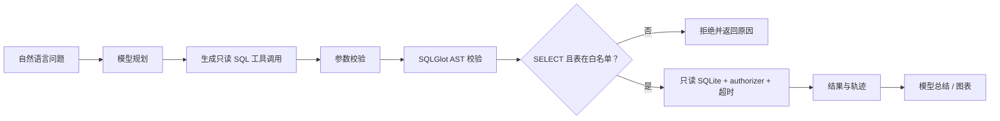

# 澄析 · 自然语言数据分析 Agent

将自然语言分析问题交给模型规划，再通过**只读 SQL 工具**查询一份合成电商数据。项目重点是安全执行和可追溯：生成的 SQL 会先经过 AST 校验，之后在只读 SQLite 连接中执行，并限制表、耗时和返回行数。

## 能力

- OpenAI 兼容模型通过 function calling 选择并调用 `run_readonly_query` 工具；服务端使用 Pydantic 再校验工具参数。
- SQLGlot 解析 SQL AST，只接受单条只读查询表达式（如 `SELECT`、`UNION`）；拒绝写入/管理节点、未授权表、多语句和过深表达式。
- 查询统一加入最多 100 行的限制，并设置约 1.2 秒执行上限。
- SQLite 以 `mode=ro` 打开，并额外设置只读 authorizer，只放行查询、读取和函数调用。
- 输出数据表、生成图表、导出 CSV，并记录模型用量、SQL、读取的表、行数与耗时。
- 没配置模型 API 时使用内置安全查询模板，不会发出模型请求。

## 查询流程



OpenAI 的函数调用以 JSON Schema 描述工具参数；文档也建议在不启用 strict 模式时用验证库检查参数。本项目同时做 API Schema 校验和服务端 Pydantic 校验。([Function calling 文档](https://developers.openai.com/api/docs/guides/function-calling)，[SQLGlot 文档](https://sqlglot.com/)，[SQLite 只读 URI](https://www.sqlite.org/uri.html))

## 本地启动

需要 Python 3.11 或更高版本。

```powershell
Copy-Item .env.example .env
python -m venv .venv
.\.venv\Scripts\Activate.ps1
python -m pip install -r requirements.txt
uvicorn app.main:app --reload --port 8001
```

打开 [http://localhost:8001](http://localhost:8001)。接口文档在 [http://localhost:8001/docs](http://localhost:8001/docs)。

## 配置模型

编辑 `.env`，设置模型服务商的 OpenAI 兼容接口：

```dotenv
LLM_API_KEY=你的模型服务密钥
LLM_BASE_URL=https://你的服务商地址/v1
LLM_MODEL=服务商提供的模型名
ADMIN_TOKEN=替换为随机长令牌
DATA_DIR=./runtime-data
```

若没有模型密钥，应用会用内置模板跑通数据查询和结果展示。模型在线模式可以根据自然语言生成 SQL，并在查询错误时尝试修正，最多三轮。

## Docker 部署

```powershell
Copy-Item .env.example .env
# 编辑 .env，设置 ADMIN_TOKEN；需要模型时再填模型 API 配置。
docker compose up --build -d
```

应用监听 `8001` 端口，SQLite 文件持久化在 `./runtime-data`。管理员数据概览需要输入 `.env` 中的 `ADMIN_TOKEN`。

## 数据字典

应用首次启动时会生成固定随机种子的合成电商数据，便于复现同一组查询结果：

| 数据表 | 字段 |
|---|---|
| `orders` | `order_id`, `order_date`, `customer_id`, `status`, `channel`, `region`, `total_cents` |
| `order_items` | `order_id`, `product_id`, `quantity`, `unit_price_cents` |
| `products` | `product_id`, `name`, `category`, `cost_cents` |
| `customers` | `customer_id`, `segment`, `city` |

## 演示问题

- `按月份统计 2026 年的销售额趋势`
- `比较不同商品品类的销售额，找出最高的品类`
- `各销售区域的订单数和收入分别是多少？`
- `不同顾客分层有多少客户和订单？`

收入分析默认排除 `cancelled` 和 `refunded` 订单。数据库只有合成样例数据。

## 项目描述参考

> 使用 Python、FastAPI、OpenAI 兼容工具调用和 SQLGlot 构建自然语言数据分析 Agent。通过 AST 检查、表白名单、只读 SQLite、authorizer、执行超时和返回行数上限约束模型生成的 SQL，并在前端展示结果图表、SQL 与工具调用轨迹。

该查询防护是单机演示应用的纵深防护，不应直接用于不可信生产数据库。生产环境仍应增加身份与行级权限隔离，并为不同租户使用独立数据库凭据或查询代理。
