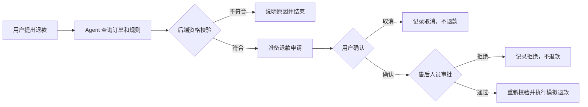

# 小满 · 电商售后 Agent

## 作品集目录

- [项目一：电商售后 Agent](README.md) — 工具调用、政策检索、双重审批和 LangGraph 状态恢复。
- [项目二：自然语言数据分析 Agent](02-data-analyst-agent/README.md) — SQL 工具调用、只读执行边界和结果追踪。

一个可本地运行、可 Docker 部署的售后服务 Agent 演示项目。它可以检索售后政策、查询模拟订单、登记工单，并用**用户确认 + 人工审批**控制模拟退款。

> 演示项目：订单、工单和退款都写入本地 SQLite，不连接真实电商、支付或物流系统。

## 项目亮点

- **真实工具调用**：模型可选择政策检索、订单查询、工单创建和退款申请工具；工具参数经过结构化校验。
- **带出处的政策问答**：从本地政策条款中做 BM25 检索，把标题、编号和原文提供给 Agent，界面也展示命中的条款。
- **可恢复的人工审批**：LangGraph 将运行状态保存在 SQLite。退款流程先等用户确认，再进入管理员审批；审批通过后才执行模拟退款。
- **副作用保护**：资格由后端按订单状态、签收时间和商品使用情况确定。退款执行时会重新检查条件，并用唯一约束防止同一申请重复入账。
- **运行轨迹**：界面记录模型调用、工具输入输出、耗时、检索出处和可用的 token 用量。
- **无 Key 演示模式**：不配置模型 API 也能体验常见场景；配置任意 OpenAI 兼容接口后则由模型决定何时调用工具。

## 退款流程



LangGraph 的 interrupt 会暂停执行并保存检查点，之后用同一个 `thread_id` 和审批决定恢复流程；实现细节见 [Interrupts 文档](https://docs.langchain.com/oss/python/langgraph/interrupts) 与 [Checkpointers 文档](https://docs.langchain.com/oss/python/langgraph/checkpointers)。

## 本地启动

需要 Python 3.11 或更高版本。

```powershell
Copy-Item .env.example .env
python -m venv .venv
.\.venv\Scripts\Activate.ps1
python -m pip install -r requirements.txt
uvicorn app.main:app --reload
```

打开 [http://localhost:8000](http://localhost:8000)。接口文档在 [http://localhost:8000/docs](http://localhost:8000/docs)。

默认 `ADMIN_TOKEN` 是 `dev-admin-change-me`，打开右上角审批工作台时输入该值。部署到外网前，请在 `.env` 中换成自己的随机长令牌。

## 配置模型

编辑 `.env`，设置模型服务商提供的 OpenAI 兼容接口：

```dotenv
LLM_API_KEY=你的模型服务密钥
LLM_BASE_URL=https://你的服务商地址/v1
LLM_MODEL=服务商提供的模型名
ADMIN_TOKEN=替换为随机长令牌
DATA_DIR=./data
```

`LLM_BASE_URL` 留空时使用 OpenAI 默认接口地址。若 `LLM_API_KEY` 或 `LLM_MODEL` 未配置，应用会切换到内置规则演示 Agent，不会发出模型 API 请求。

## Docker 部署

```powershell
Copy-Item .env.example .env
# 编辑 .env，设置 ADMIN_TOKEN；需要模型时再填 LLM_API_KEY、LLM_BASE_URL 和 LLM_MODEL。
docker compose up --build -d
```

应用监听 `8000` 端口；数据库和 LangGraph 检查点持久化在 `./runtime-data`。本项目用 SQLite 方便单机演示与部署；生产多实例部署时应将业务库和检查点切换为 PostgreSQL，并增加正式的用户身份与权限管理。

## 演示场景

侧边栏订单可以点击，也可以把下面的消息直接发给 Agent：

1. `帮我查一下订单 ORD-2026-1003 的物流状态`：查询运输中订单和物流单号。
2. `七日无理由退货的条件是什么？`：展示命中的政策条款和出处。
3. `订单 ORD-2026-1001 我想申请退款，商品没有使用`：用户确认后，打开审批工作台通过，观察模拟退款和审计轨迹。
4. `订单 ORD-2026-1002 我想申请退款`：验证超过签收期限的订单不能申请。
5. `订单 ORD-2026-1004 的台灯有问题，灯罩破损了`：创建商品问题工单。

## 目录结构

```text
app/
  agent.py       # LangGraph 状态图、模型工具调用、审批中断与恢复
  database.py    # SQLite 订单、工单、退款申请与审计日志
  knowledge.py   # 中文分词与 BM25 政策检索
  main.py        # FastAPI、聊天与审批 API
  static/        # 对话界面、审批工作台与轨迹面板
data/
  policies.json  # 可引用的售后政策条款
```

## 求职项目描述参考

> 使用 Python、FastAPI 与 LangGraph 构建电商售后 Agent，支持 OpenAI 兼容模型的工具调用、本地政策检索、模拟订单查询与售后工单创建。通过持久化检查点实现用户确认及人工审批的暂停恢复；对退款工具实现资格复核、幂等约束和审计记录，并在前端展示模型与工具调用轨迹。

可以在此基础上继续补充自动化评测集、PostgreSQL、认证授权，以及对接真实工单或电商 API。
